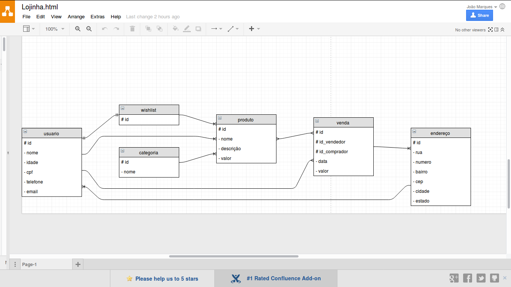

Projeto: lojinha

* João Victor
* Neri Joelso

A ideia principal do projeto seria desenvolver uma loja.
Sabendo que o ficaria simples, optamos por transformar em um site mediador de compra e vendas entre usuário X usuário.

O que poderá ser feito no site:

Os usuários poderão se cadastrar no site.
Cadastrar produtos para venda.
Comprar produtos.
Adicionar produtos em sua lista de desejos.
Buscar produtos por nome.
Filtrar produtos por valor, categoria.

O sistema recomendará produtos para o usuário baseando-se em seu histórico de compras dentro do site.
